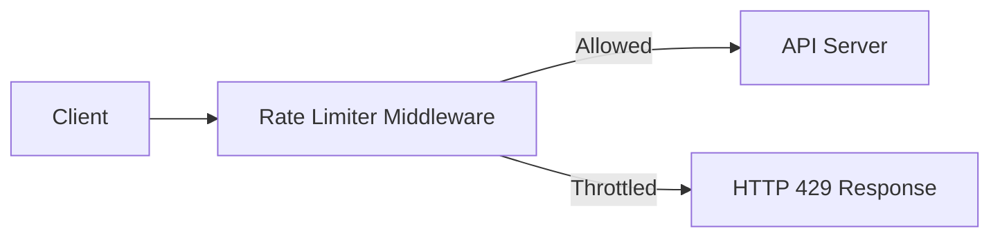
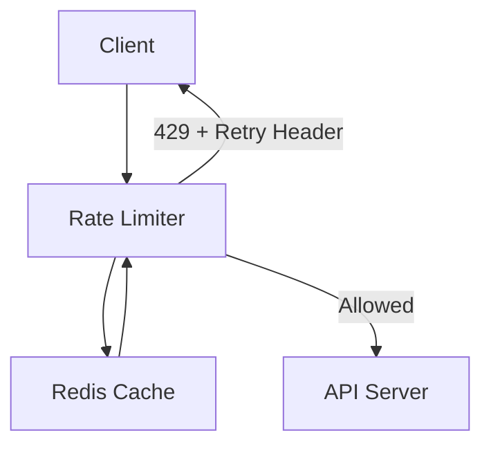

---
tags:
  - systemdesign
---
  
# 📑 Rate Limiter System Design Cheat Sheet

## 1. Problem Overview
Rate limiting controls the number of client requests sent to a server over a period.  
Goals:  
- Prevent **DoS attacks**  
- Reduce **server overload**  
- Control **API costs**  
- Maintain **fair usage**

---

## 2. Requirements
- ⏱️ **Low latency** (should not slow down requests)  
- 🛑 **Accurate throttling** (hard or soft limits)  
- 🧠 **Flexible rules** (per-user, per-IP, per-endpoint)  
- ⚡ **High fault tolerance** (rate limiter failure ≠ system failure)  
- 🌍 **Distributed support** (works across servers)  
- 📢 **User feedback** (`429 Too Many Requests`, headers with retry info)

---

## 3. High-Level Design

- Middleware or API Gateway placement.  
- Uses in-memory stores (Redis) for counters.  
- Returns headers to clients.  

---

## 4. Algorithms Deep Dive

### 4.1 Token Bucket
- Tokens refill at constant rate. Each request consumes one.  
- **Pros:** Handles bursts; widely used (Stripe, AWS).  
- **Cons:** Requires careful parameter tuning.  
- 🔗 [AWS API Gateway Throttling](https://docs.aws.amazon.com/apigateway/latest/developerguide/api-gateway-request-throttling.html)  
  - *Summary:* AWS API Gateway supports configurable rate limits and burst limits using token bucket algorithm to control traffic.

### 4.2 Leaky Bucket
- FIFO queue; requests processed at constant rate.  
- **Pros:** Smooths traffic.  
- **Cons:** Old requests can block newer ones.  
- 🔗 [Shopify API Limits](https://help.shopify.com/en/api/reference/rest-admin-api-rate-limits)  
  - *Summary:* Shopify enforces leaky-bucket-based limits per app and per store, ensuring fair API usage.

### 4.3 Fixed Window Counter
- Time divided into fixed intervals with counters.  
- **Pros:** Simple, low memory.  
- **Cons:** Bursts at window edges.  
- 🔗 [Twitter API Limits](https://developer.twitter.com/en/docs/basics/rate-limits)  
  - *Summary:* Twitter enforces strict per-15 minute windows for different endpoints; limits vary by resource type.

### 4.4 Sliding Window Log
- Store request timestamps; prune outdated ones.  
- **Pros:** Accurate; no burst bypass.  
- **Cons:** High memory usage.  
- 🔗 [Redis Sorted Set Rate Limiting](https://engineering.classdojo.com/blog/2015/02/06/rolling-rate-limiter/)  
  - *Summary:* Implements rolling rate limits with Redis sorted sets to efficiently handle timestamped requests.

### 4.5 Sliding Window Counter
- Weighted average between current & previous window.  
- **Pros:** Efficient approximation.  
- **Cons:** Assumes uniform distribution.  
- 🔗 [Cloudflare Scaling](https://blog.cloudflare.com/counting-things-a-lot-of-different-things/)  
  - *Summary:* Cloudflare explains approximate sliding window counter, achieving scale for billions of requests.

---

## 5. Detailed Architecture

- Redis used for counters & timestamps.  
- Config-driven rules, pulled into cache.  
- Lua scripts / atomic ops handle concurrency.  

---

## 6. Distributed Environment Challenges
- **Race condition:** solved with Redis Lua scripts or atomic ops.  
- **Synchronization:** centralized stores preferred over sticky sessions.  
- **Performance:** edge servers reduce latency.  
- 🔗 [Lyft Ratelimit OSS](https://github.com/lyft/ratelimit)  
  - *Summary:* Lyft open-sourced their Envoy-based rate limiter, supporting rule configuration and distributed caching.

---

## 7. Client Communication
- HTTP 429: Too Many Requests.  
- Headers:  
  - `X-RateLimit-Remaining`  
  - `X-RateLimit-Limit`  
  - `X-RateLimit-Retry-After`  

---

## 8. Monitoring & Optimization
- Gather analytics to tune thresholds.  
- Adjust for flash sales/bursty traffic.  
- Support multi-datacenter deployment.  
- 🔗 [Google Cloud Rate Limiting Strategies](https://cloud.google.com/solutions/rate-limiting-strategies-techniques)  
  - *Summary:* Google describes different strategies (fixed, sliding, token, leaky) and tradeoffs for scalability.

---

## 9. Reference Materials with Summaries
- [Google Cloud: Rate Limiting Strategies](https://cloud.google.com/solutions/rate-limiting-strategies-techniques) — overview of techniques and best practices.  
- [Twitter API Limits](https://developer.twitter.com/en/docs/basics/rate-limits) — strict resource-based API limits.  
- [Google Docs API Limits](https://developers.google.com/docs/api/limits) — quotas like 300 reads per user per 60s.  
- [Stripe Rate Limiters](https://stripe.com/blog/rate-limiters) — practical use of token bucket at scale.  
- [Shopify API Limits](https://help.shopify.com/en/api/reference/rest-admin-api-rate-limits) — explains per-app and per-store rules.  
- [Redis](https://redis.io/) — in-memory cache enabling atomic counter ops.  
- [Lyft Ratelimit OSS](https://github.com/lyft/ratelimit) — distributed rate limiter with rule configs.  
- [Cloudflare Scaling](https://blog.cloudflare.com/counting-things-a-lot-of-different-things/) — how to scale rate limiting across billions of domains.  

---

If you liked this cheat sheet on Rate Limiting, you may like my cheat sheet for a [[URL Shortener]] :)