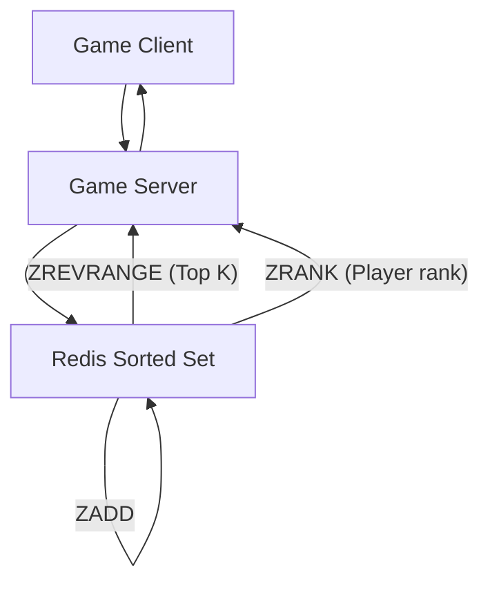
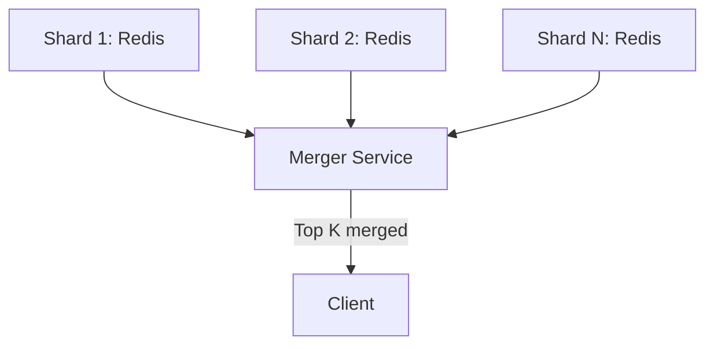
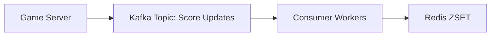

# 🎮 Real-Time Gaming Leaderboard – System Design Cheatsheet

  

## 1. Problem Overview

Design a **real-time leaderboard system** for an online multiplayer game.

Requirements:

- Players earn scores during gameplay.

- Leaderboard must show **top N players** in real time.

- Support **millions of players** concurrently.

- Allow **rank lookups**: "What’s my rank?"

- Efficient **updates** as scores change.

  

---

  

## 2. Functional Requirements

- **Real-time updates** when scores change.

- **Get Top K** players quickly (e.g., top 100).

- **Get Player Rank** efficiently.

- Handle **concurrent updates** from many players.

  

---

  

## 3. Non-Functional Requirements

- **Scalability**: millions of concurrent players.

- **Low latency**: real-time feel (<100ms queries).

- **High availability**: no downtime during tournaments.

- **Consistency trade-offs**: eventual vs strong.

  

---

  

## 4. Naïve Approach

- Use a **relational DB** table: `(player_id, score)`.

- Query: `ORDER BY score DESC LIMIT N`.

- Problems:

	- Sorting large tables is expensive (O(n log n)).
	
	- Slow updates when many players change scores.
	
	- Not feasible for real-time scale.

  

---

  

## 5. Optimized Solution: Redis Sorted Sets

Redis **Sorted Sets (ZSET)** are ideal for leaderboards.

  

- Operations:

	- `ZADD leaderboard score player_id` → Add/update score.
	
	- `ZREVRANGE leaderboard 0 K-1` → Top K players.
	
	- `ZRANK leaderboard player_id` → Get player rank.
	
	- `ZSCORE leaderboard player_id` → Get player score.

  

### Complexity:

- Insert/update: **O(log n)**

- Top-K retrieval: **O(K)**

- Rank lookup: **O(log n)**

  

  

---

  

## 6. Scaling Beyond Single Redis Instance

- A single Redis instance has **memory & throughput limits**.

- Solutions:

	1. **Sharding** leaderboards across Redis nodes.
	
		- Partition by player_id hash.
		
		- Problem: Getting **global top K** is harder (need to merge top-K from each shard).
		
	2. **Tiered Leaderboards**:
	
		- Keep top 10k players in a global Redis instance.
		
		- Store the rest in sharded Redis clusters.

  

  

---

  

## 7. Caching & Eventual Consistency

- Cache **hot queries** (top 100 leaderboard).

- Update cache every few seconds (trade-off real-time vs efficiency).

- Player’s own rank → can be queried on-demand.

  

---

  

## 8. Backpressure & Reliability

- Use **Kafka / Pub-Sub** for buffering score updates.

- Avoid overwhelming Redis with bursts.

- Consumer workers apply updates sequentially.

  

  

---

  

## 9. Edge Cases

- Ties in score → secondary sort by timestamp or player_id. Priority to older timestamps.

- Player inactivity → handle stale scores.

- Large-scale tournaments → pre-warm caches.

  

---

# 🔎 Deep Dives

## A. Why Redis Sorted Sets?

- Combines **hash table + skip list**.

- Efficient ordered operations.

- Proven use case in gaming leaderboards, social feeds, ranking systems.

  

---

  

## B. Sharding Leaderboards

- **Problem**: No single Redis can hold 100M+ players.

- **Approach**:

- Hash partition players.

- Use a **merger service** to aggregate results.

- Trade-off:

- Fast updates, but **Top-K queries require merging multiple lists**.

- Can approximate Top-K by only keeping top scorers globally.

  

---

  

## C. Consistency Trade-offs

- **Strong consistency**: expensive, requires global locks.

- **Eventual consistency**: acceptable for leaderboards (slight lag is fine).

- Many systems use **5–10s delayed updates** to balance scale.

  

---

  

## D. Kafka Backpressure Handling

- Kafka helps **smooth out bursty traffic**.

- If Redis lags → messages queue in Kafka.

- Can apply **sampling** (e.g., only process 90% updates) in extreme load cases.

  

---

  

# 📚 Reference Deep Dives (from ByteByteGo links)

  

## 1. Redis Sorted Sets Documentation

- Core ops: `ZADD`, `ZREM`, `ZRANGE`, `ZREVRANGE`, `ZRANK`, `ZSCORE`.

- Underlying: skip list + dictionary.

- Time complexity:

- `ZADD` / `ZREM` = O(log N).

- Range queries = O(log N + M).

  

---

  

## 2. System Design: Leaderboard on Highscalability

- Notes from case study:

- Use **in-memory ranking** (Redis/Memcache).

- **Precompute ranks** for fast lookup.

- Store **metadata** (avatars, usernames) separately from leaderboard.

  

---

  

## 3. Leaderboards with Redis (RedisLabs blog)

- Real-world Redis leaderboard examples.

- Tips:

	- Use **pipelines** for batch updates.
	
	- Track **weekly/monthly leaderboards** by creating new keys.
	
	- Archive old leaderboards into cold storage.

  

---

  

## 4. Sharding Leaderboards Discussion (StackOverflow)

- Common strategies:

	- **Player-based sharding**.
	
	- **Time-window sharding** (per match or tournament).
	
	- Merging Top-K across shards using **heap or k-way merge**.

  

---

  

# ✅ Key Takeaways

- Redis Sorted Sets = perfect fit for leaderboards.

- Scaling = shard players & merge results.

- Cache hot queries (top 100) to reduce load.

- Eventual consistency is acceptable (a few seconds delay).

- Use Kafka/pub-sub for reliable updates under bursts.
