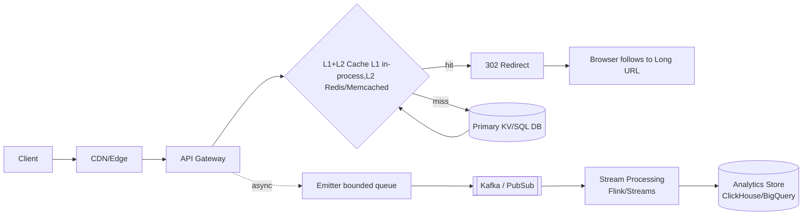
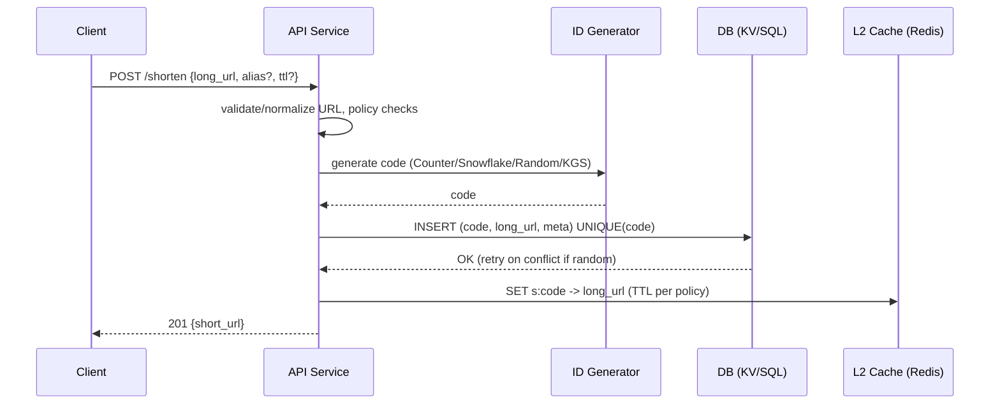
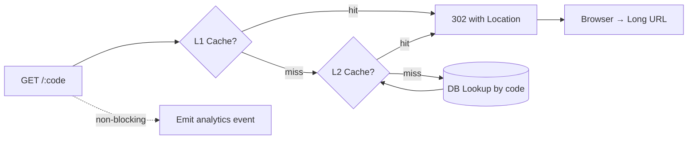
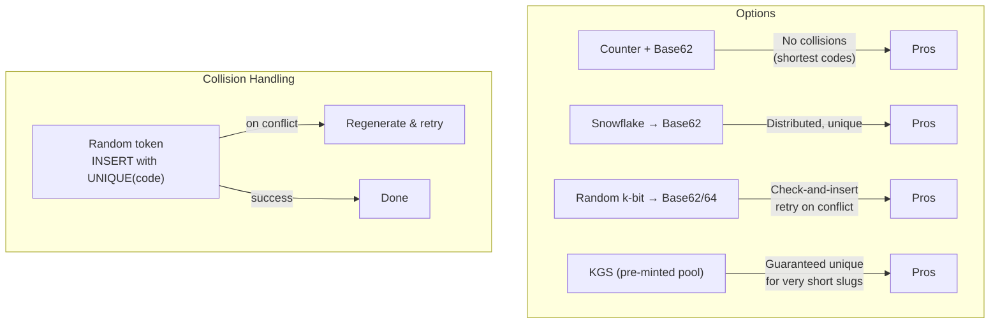
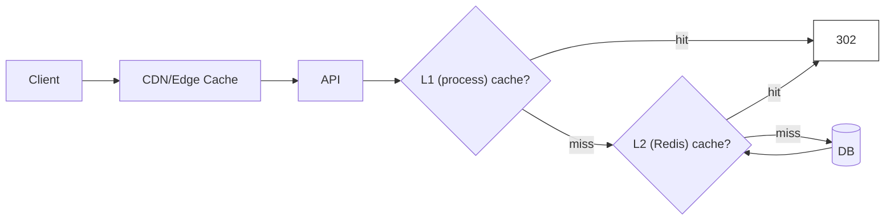
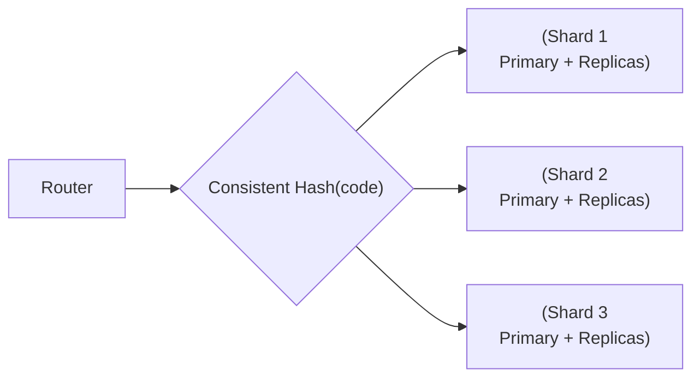
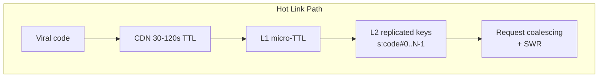
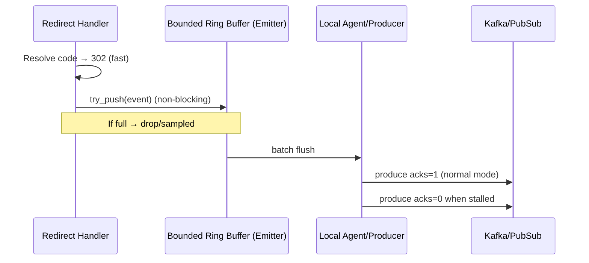
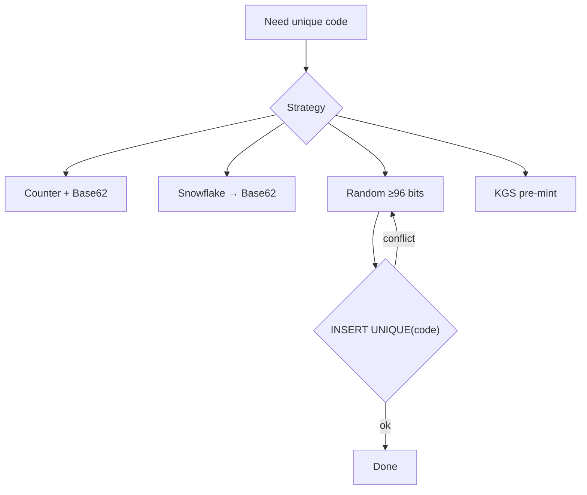

---
tags:
  - systemdesign
---

# URL Shortener System Design – Blended Cheat Sheet (ByteByteGo-style)

  

This cheat sheet blends the common core concepts taught in popular URL shortener system-design walkthroughs (capacity planning, API shape, ID strategies, caching tiers, sharding, and multi‑region considerations) with the practical tactics we discussed (hot-key protection, async analytics, backpressure). It’s structured as: **high-level → diagrams → deep dives**, with cross-links.

  

---

  

## High-Level Architecture

  



  

**Key ideas (ByteByteGo-style essentials):**

- **Clarify requirements:** create, redirect, custom alias, optional expiration, analytics, high availability, low latency.

- **Capacity planning (assume to size):** target QPS, reads ≫ writes, storage growth, hot-link behavior, multi‑region needs.

- **API surface:** `POST /shorten`, `GET /:code`, optional `PUT /:code` (update), `DELETE /:code`, `GET /:code/stats`.

- **Data model:** `code (PK)`, `long_url`, `created_at`, `owner_id`, `ttl/expiry`, optional `checksum`, `flags`.

  

Jump to: [ID Generation](#unique-id-generation), [Redirect Flow](#redirect-flow), [Caching](#caching-strategy), [Sharding](#storage--sharding), [Hot Keys](#scaling--hot-key-protection), [Analytics & Backpressure](#analytics--backpressure).

  

---

  

## URL Shortening – Deep Dive

  



  

**Notes:**

- Validate/normalize (http→https? trailing slashes? UTM handling).

- Enforce domain allow/deny lists, phishing/malware scans (async if needed).

- Dedup optional (checksum of long_url ⇒ “return existing code”).

  

---

## Unique ID Generation

^2654e9

  


- **Base62/Base64 = encoding, not uniqueness.**

- Strategies:

	- **Counter + encode**: short, predictable, no collisions.
	
	- **Snowflake IDs**: distributed, collision-free, ~11 chars.
	
	- **Random tokens**: 72–96 bits + unique index, retried on collision.
	
	- **KGS**: pre-mint short codes, lease atomically.

  

- Deep Dive:

	- **Counter+encode** → simplest, but predictable.
	
	- **Snowflake** → distributed, safe at scale.
	
	- **Random+unique index** → best for privacy/security.
	
	- **KGS** → ensures short vanity codes stay unique.


---

## Redirect Flow

  



  

**302 vs 301:** Prefer **302** (temporary) so you can change/expire links later. Control CDN/browser caching via `Cache-Control` headers.

  

---

  

## Hash + Collision Resolution

  



  

**Guidance:**

- Base62/Base64 are **encodings** (≈6 bits/char), not uniqueness.

- For random tokens: choose **≥96 bits** to make collisions negligible at multi‑billion scale; enforce `UNIQUE(code)` and retry on the rare conflict.

- For very short vanity codes (6–8 chars), use **KGS** (Key Generation Service) that *leases* unused codes atomically.

- Snowflake avoids coordination; monotonic → add salting to avoid range hotspots.

  

---

  

## Caching Strategy

  



  

**Practices:**

- **Negative caching** for “not found” (short TTL) to deflect brute-force scans.

- **Stampede protection:** per-key mutex or **stale‑while‑revalidate**.

- **Hot key protection:** replicate hot keys (N buckets), jittered TTLs, tiny L1 TTL (100–500ms).

- **TTL policy:** per-code TTL if links expire; otherwise long-lived cache entries.

  

---

  

## Storage & Sharding

  



  

**Approaches:**

- Hash-based sharding on `code` (uniform distribution for Snowflake/random/KGS).

- **Consistent hashing** eases shard add/remove with minimal rebalancing.

- For monotonic IDs (counter/Snowflake), **salt** the key to avoid last-shard hotspots.

- Replication (e.g., RF=3) for HA. Reads from replicas; writes to primary or quorum (KV).

  

---

  

## Scaling & Hot Key Protection

  



  

**Tactics:** CDN first; L1 micro‑cache; replicate hot keys; per-key locks; stale‑while‑revalidate; adaptive TTL/jitter; rate limits per IP/ASN for abuse waves.

  

---

  

## Analytics & Backpressure

  



  

**Backpressure plan:**

- **Sample before enqueue** (Bernoulli/stratified).

- **Bounded, non-blocking** emitter queue; drop-if-full with metrics.

- Adaptive modes: NORMAL → DEGRADED → STALLED (e.g., keep **10%**).

- Use **lite payload** under pressure; never block 302.

  

---

  

## Capacity Planning (ByteByteGo-style checklist)

- **Assumptions:** peak RPS (reads, writes), growth rate, link lifetime, % hot vs long tail.

- **Storage:** rows per day × bytes/row (code + URL + metadata) × retention.

- **Throughput:** cache hit ratio target (e.g., >95%); DB QPS budget on misses.

- **Latency goals:** origin p99 < 20 ms; cache p99 < 5 ms; creation p99 < 50 ms.

- **Availability:** multi-AZ, multi-region read-anywhere; RPO/RTO targets.

  

---

  

## API Reference (sketch)

  

```http

POST /v1/shorten

{ "long_url": "...", "alias": "optional", "ttl_days": 30 }

  

GET /v1/r/{code}

→ 302 Location: <long_url>

  

PUT /v1/links/{code}

{ "long_url": "...", "ttl_days": 60 }

  

DELETE /v1/links/{code}

  

GET /v1/links/{code}/stats?window=1d

```

  

---

  

## Trade-offs Summary

- **Counter vs Snowflake vs Random vs KGS:** shortest vs distributed vs private vs guaranteed-short.

- **302 vs 301:** flexibility vs aggressive client caching.

- **KV vs SQL:** simple scale vs richer queries/constraints.

- **Edge analytics vs origin:** lowest latency vs simplicity.

  

---

  

# Deep Dives

  

## ID Generation (Details)

  



  

- **Base62** alphabet avoids `+/=` and is URL-friendly.

- **Random ≥96 bits** ⇒ ~16 base62 chars, collision risk negligible; still keep UNIQUE and retry.

- **Snowflake**: timestamp + machine + sequence.

- **KGS**: pool refilled in background; issue via atomic flip from `available→used`.

  

## Caching (Details)

- **Negative cache** “not found” for 30–60s.

- **Stampede control** via per-key lock (Redis `SETNX`) or SWR.

- **Hot keys**: replicate N copies; client hashes to pick copy; micro L1 to flatten spikes.

  

## Sharding (Details)

- **Consistent hashing** ring maps `hash(code)` → shard. Small movement on reshard.

- **Replication**: quorum reads/writes for HA (KV); primary/replica in SQL.

- **Migrations**: dual-write during reshard; shadow reads to validate.

  

## Hot Key Protection (Details)

- **CDN** with cautious TTL to retain control (use 302).

- **Jittered TTLs** so replicas don’t expire simultaneously.

- **Adaptive promotion**: pin hot keys in memory during spikes.

  

## Analytics & Backpressure (Details)

- **Emitter-side sampling** + **bounded ring buffer** ensures no blocking.

- **Modes**: `NORMAL(100%)`, `DEGRADED(50–80%)`, `STALLED(10%)`, `RECOVERY(ramp-up)`.

- **Metrics**: queue depth, producer p99, send error rate; enforce floors per tenant (stratified sampling).

- **Uniqueness/HLL**: HyperLogLog for unique visitors; windowed aggregates for dashboards.

  

---

  

## Quick Interview Talk Track (2–3 minutes)

- “Reads dominate. I front with a CDN and use **302** so I can change/expire links. Redirect path: **L1 → L2 → DB** with negative caching and stampede control. For IDs, I’d choose **Snowflake→base62** or **random‑96b + UNIQUE**; **KGS** if we need short vanity codes. Storage is sharded by **consistent hash(code)** with replication. Hot links get **replicated cache keys** and **micro L1 TTL** to avoid hotspots. Analytics is strictly **async** with **emitter‑side sampling**, **bounded queues**, and p99‑driven shedding, so redirect p99 stays < 20ms even under spikes.”